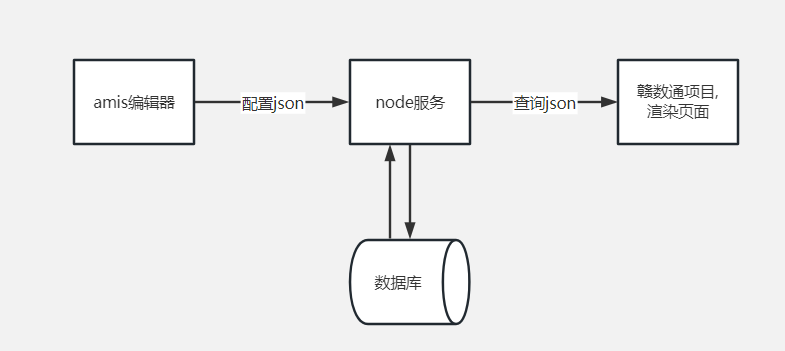

# 1.什么是低代码
> 低代码（Low Code）是一种可视化拖拽的应用开发方法，用较少的代码、以较快的速度来交付应用程序,称之为低代码。

# 2.什么是零代码或无代码
> 是一种完全不需要任何代码编程值通过可视化拖拽配置就可以生成所需要交付的应用程序,称之为零代码

# 3. 面向用户
> 主要是服务于一些信息化企业,可以快速实现市场需求

# 4. 对比优缺点
> 低代码可以在固定的基础之上.做一些简单个性化的东西,编辑人员需要有一定的编程基础
> 零代码编辑器来更简单,物料一般比较完善,更加全面,不能加一些个性化的东西

# 5. 现在前端的实践-amis低代码前端框架

1. 在赣数通内集成了amis框架-demo

2. amis优点
    > 大量内置组件（120+），一站式解决

    > 支持扩展：除了低代码模式，还可以通过 自定义组件 来扩充组件

    > 经历了长时间的实战考验：amis 在百度内部得到了广泛使用，在 6 年多的时间里创建了 5 万页面，从内容审核到机器管理，从数据分析到模型训练，amis 满足了各种各样的页面需求，最复杂的页面有超过 1 万行 JSON 配置。

    > 有很多完整的示例

3. amis 不适合做什么？

    > 大量定制 UI

    > 极为复杂或特殊的交互

    > 后端数据结构需要高度按照amis需要的格式来返回,否则的话.转化结构数据会很复杂

4. 当前这套方案还比较简单,只是主流程走通了,真的要运用还有很多东西需要处理

    > 整体amis样式的优化

    > 登录问题(编辑器的登录和我们赣数通相关联)

    > 编辑器的预览问题
