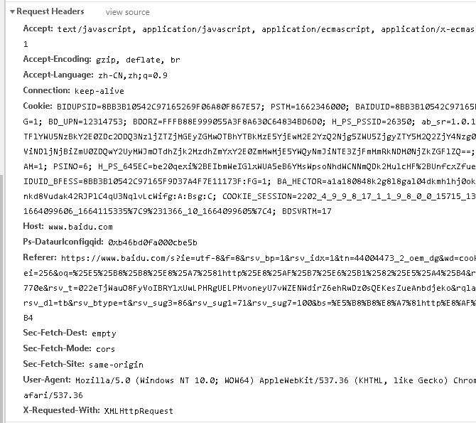
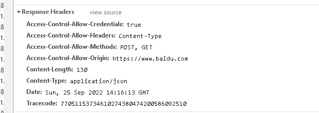
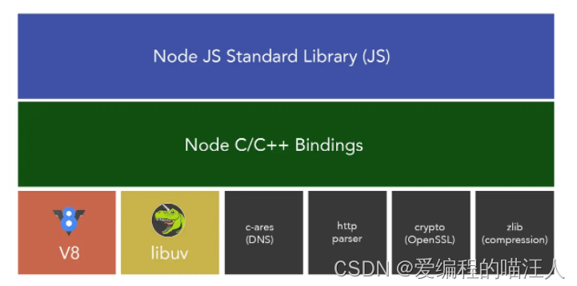

前端资源网站: 
    [大纲](https://blog.csdn.net/cYang2030/article/details/110727999)
    [aku分享平台](https://tech-team.akulaku.com/blog/articlelist/ALL)
    [single-spa](https://blog.csdn.net/weixin_44420276/article/details/117648253)

# 一.html基础知识
- H5新标签,article,footer,header,nav,section,
- video,audio,
    > audio支持 mp3,wav,ogg格式
- canvas
    1. htm5的新特性
    2. 图形容器
    3. 通过js绘制
    > 作用
        1. 网页游戏
        2. 数据可视化-echarts
        3. 广告banner的动态效果


- h5的新api,如XMLHttpRequest,Media

# 二.js基础知识
- js类型
    1. 基本类型(原始类型): String, Nunber, Boolean, Null, Undefined, Symbol(es6新增)
    2. 引用类型(对象类型): Object, Array, Function, RegExp, Date
- let, const, var
- 字符串方法
- 数组方法
- 对象操作方法
- this指向
- 类型判断
- es6
    1. let const 
    2. 模板字符串
    3. 解构
    4. 函数默认值
    5. 箭头函数
    6. for-in（遍历键值对的key）  fo-of(遍历键值对的value)  
    7. 扩展运算符 ...arr
    8. class
    9. import export
    10. Promise
    11. async/await
    12. Symbol
    13. Set、Map、WeakSet和WeakMap等
- Set、Map、WeakSet和WeakMap等
    > Set
    1. 成员不能重复； 
    2. 只有键值，没有键名，有点类似数组； 
    3. 可以遍历，方法有 add、delete、has 
    > WeakSet 
    1. 成员都是对象（引用）； 
    2. 成员都是弱引用，随时可以消失（不计入垃圾回收机制）。可以用来保存 DOM 节点，不容易造成内存泄露； 
    3. 不能遍历，方法有 add、delete、has； 
    > Map
    1. 本质上是键值对的集合，类似集合； 
    2. 可以遍历，方法很多，可以跟各种数据格式转换；
    > WeakMap 
    1. 只接收对象为键名（null 除外），不接受其他类型的值作为键名； 
    2. 键名指向的对象，不计入垃圾回收机制； 
    3. 不能遍历，方法同 get、set、has、delete；

- 存储,localStorage,SessionStorage,cookie,session
    1. 相同点： 都是保存在浏览器端、且同源的，刷新不消失
    2. 不同点： 

		    1. 存储大小 ：（ localStorage ， essionStorage ） 5MB    cookie 4kb	
		    2. 生效时间： localStorage 不删除永久存在   sessionStorage 会话结束    cookie过期时间
		    3. 作用域：（sessionStorage）不在不同的浏览器窗口中共享，即使是同一个页面， （ localstorage， cookie） 在所有同源窗口中都是共享的

    3. cookie 和 session对比：

            1. 位置不同：Session是位于服务器上面；Cookie是位于浏览器上面
            2. 大小不同：Cookie的大小相对而言要小一些，只允许4KB，而session是无限量的
            3. 安全性：Cookie在浏览器上，容易被修改，安全性相对于Session安全性较低。
            4. 时间设置:Cookie时间可以使Cookie过期。但是使用Session-destory（），销毁会话。


- this,bind,apply,call
- 类型判断 typeof  instanceOf Object.prototype.toString.call()
    1. typeof 只能判断原始类型 string, number, boolean, null, undefined, Symbol
        - type 1 === 'number'
        - type 'a' === 'string'
        - type true === 'boolean'
        - type null === 'null'
        - type undeinfed === 'undefined'
        - type Symbol('aaa') === 'symbol'
    2. 判断是否是数组方法
        - arr.constructor.toString().includes("Array")
        - Object.prototype.toString.call([]) === "[object Array]"
        - [] instanceof Array
        - Array.isArray(arr)

- Promise race,all,final等
- 事件冒泡，事件捕获
    1. 点击元素，
    2. 事件捕获： document -> html -> body -> div -> p
    3. 事件冒泡： p -> div -> body -> html -> document
    4. element.addEventListener(event, function, useCapture)
        - useCapture:   
            1. false(默认)： 冒泡
            2. true： 捕获


    

- 原型,原型链,继承,类
- 垃圾回收
    1. 其原理是：垃圾收集器会定期（周期性）找出那些不在继续使用的变量，然后释放其内存。但是这个过程不是实时的，因为其开销比较大并且GC时停止响应其他操作，所以垃圾回收器会按照固定的时间间隔周期性的执行。
    2. 标记清除： js中最常用的垃圾回收方式就是标记清除。当变量进入环境时，例如，在函数中声明一个变量，就将这个变量标记为“进入环境”。从逻辑上讲，永远不能释放进入环境的变量所占用的内存，因为只要执行流进入相应的环境，就可能会用到它们。而当变量离开环境时，则将其标记为“离开环境”。
    3. 引用计数： 的含义是跟踪记录每个值被引用的次数。当声明了一个变量并将一个引用类型值赋给该变量时，则这个值的引用次数就是1。如果同一个值又被赋给另一个变量，则该值的引用次数加 1。相反，如果包含对这个值引用的变量又取得了另外一个值，则这个值的引用次数减 1。当这个值的引用次数变成 0 时，则说明没有办法再访问这个值了，因而就可以将其占用的内存空间回收回来。这样，当垃圾回收器下次再运行时，它就会释放那些引用次数为 0 的值所占用的内存。（存在循环引用等问题）
    
- 闭包

        1.函数套函数，
        2.内部函数访问外部函数变量，参数
        3.变量和参数不会被垃圾回收机制回收 （标记清除，引用计数）
        4. 优点： 1.变量保存在内存中，2.不会造成全局污染，3.私有成员
        5. 缺点： 常驻内存 增大内存的使用量 使用不当会造成内存的泄露
        6. 应用场景
            1.setTimeout原生的setTimeout有一个缺陷，你传递的第一个函数不能带参数就可以用闭包来实现传参效果
            2.回调
            3.函数防抖 ，节流 防抖：函数被高频触发时停止触发后延时n秒再执行函数 节流：函数被高频触发时延时n秒才会执行
            4.封装私有变量


- 防抖与节流
    1. 	防抖debounce： 触发之后事件，指定时间之后再执行。  再搜索框查询，输入之后1000秒毫秒内没有输入再触发请求
	2. 节流throttie：指定时间内多次触发只执行一次。 resize, scroll, 按钮点击
- eval
- 深度克隆
- defineProperty, Proxy
- get,post,put,delete,options
- 简单说说 js 中有哪几种内存泄露的情况 
    1. 全局变量； 
    2. 闭包； 
    3. 未被清空的定时器； 
    4. 未被销毁的事件监听； 
    5. DOM 引用；

    
# 三.css基础知识
- import,以及清除所有样式
- css3新特性

    1. 3个边框属性,border-radius, box-shadow, border-image
    2. background-clip、background-origin、background-size 、background-break
    3. word-wrap 

        normal：使用浏览器默认的换行,
        break-all：允许在单词内换行
    4. 颜色-rgba与hsla
    5. transition: (transition: all 0.5s ease-in-out);

        1. transition-property: width; 
        2. transition-duration: 1s;
        3. transition-timing-function: linear;
        4. transition-delay: 2s;

    6. transform
        1. transform: translate(120px, 50%)：位移
        2. transform: scale(2, 0.5)：缩放
        3. transform: rotate(0.5turn)：旋转
        4. transform: skew(30deg, 20deg)：倾斜

    7. animition

        1. @keyfram moveTranslate{} 帧动画
        2. animation: moveTranslateY3 1s 0s infinite;

    8. linear-gradient

- BFC
- 浮动
    > 清楚浮动方法
    1. 末尾加标签: clear: both
    2. 父元素: overflow: hidden
    3. 给父元素设置高度
    4. 

- 定位,fixed,absolute,relative,sticky,static
- flex
- gird
- 水平,垂直居中
- px,em,rem,vh,vw
- css引入方式

    1. 行内
    2. 嵌入
    3. link引入
    4. @import引入
    

- link和@import区别

    > 1.link如何加载css还可以加载其他东西,比如标题图等,@import只能加载css

    > 2.link是在页面载入时加载,而@import是页面完全载入后加载,所以开始没样式,闪烁下才有样式

    > 3.link无兼容问题,@import是css2.1提出,低版本浏览器不支持

    > 4.link支持使用js控制dom改变样式,后者不支持

- 盒子模型
    box-sizing 来指定盒模型，分别是:
    content-box: 标准盒模型  ( Element width = width + border + padding)
    border-box；怪异盒模型  ( Element width = width )
- less sass 

# 四.浏览器基础知识
- 跨域
- 常见http请求头
    1. 请求头：
        

        Accept：指定客户端能够接收的内容类型。

        Accept-Charset：浏览器可以接受的字符编码集。

        Accept-Encoding：指定浏览器可以支持的web服务器返回内容压缩编码类型。

        Accept-Language：浏览器可接受的语言。

        Accept-Ranges：可以请求网页实体的一个或者多个子范围字段。

        AuthorizationHTTP：授权的授权证书。

        Cache-Control：指定请求和响应遵循的缓存机制。

        Connection：表示是否需要持久连接。（HTTP 1.1默认进行持久连接）

        CookieHTTP：请求发送时，会把保存在该请求域名下的所有cookie值一起发送给web服务器。

        Content-Length：请求的内容长度。

        Content-Type：请求的与实体对应的MIME信息。

        Date：请求发送的日期和时间。

        Expect：请求的特定的服务器行为。

        From：发出请求的用户的Email。

        Host：指定请求的服务器的域名和端口号。

        If-Match：只有请求内容与实体相匹配才有效。

        If-Modified-Since：如果请求的部分在指定时间之后被修改则请求成功，未被修改则返回304代码。

        If-None-Match：如果内容未改变返回304代码，参数为服务器先前发送的Etag，与服务器回应的Etag比较判断是否改变。

        If-Range：如果实体未改变，服务器发送客户端丢失的部分，否则发送整个实体。

        If-Unmodified-Since：只在实体在指定时间之后未被修改才请求成功。

        Max-Forwards：限制信息通过代理和网关传送的时间。

        Pragma：用来包含实现特定的指令。

        Proxy-Authorization：连接到代理的授权证书。

        Range：只请求实体的一部分，指定范围。

        Referer：先前网页的地址，当前请求网页紧随其后,即来路。

        TE：客户端愿意接受的传输编码，并通知服务器接受接受尾加头信息。

        Upgrade：向服务器指定某种传输协议以便服务器进行转换（如果支持。

        User-AgentUser-Agent：的内容包含发出请求的用户信息。

        Via：通知中间网关或代理服务器地址，通信协议。

        Warning：关于消息实体的警告信息

    2. 响应头

        

        Accept-Ranges：表明服务器是否支持指定范围请求及哪种类型的分段请求。

        Age：从原始服务器到代理缓存形成的估算时间（以秒计，非负）。

        Allow：对某网络资源的有效的请求行为，不允许则返回405。

        Cache-Control：告诉所有的缓存机制是否可以缓存及哪种类型。

        Content-Encodingweb：服务器支持的返回内容压缩编码类型。。

        Content-Language：响应体的语言。

        Content-Length：响应体的长度。

        Content-Location：请求资源可替代的备用的另一地址。

        Content-MD5：返回资源的MD5校验值。

        Content-Range：在整个返回体中本部分的字节位置。

        Content-Type：返回内容的MIME类型。

        Date：原始服务器消息发出的时间。

        ETag：请求变量的实体标签的当前值。

        Expires：响应过期的日期和时间。

        Last-Modified：请求资源的最后修改时间。

        Location：用来重定向接收方到非请求URL的位置来完成请求或标识新的资源。

        Pragma：包括实现特定的指令，它可应用到响应链上的任何接收方。

        Proxy-Authenticate：它指出认证方案和可应用到代理的该URL上的参数。

        refresh：应用于重定向或一个新的资源被创造，在5秒之后重定向（由网景提出，被大部分浏览器支持）

        Retry-After：如果实体暂时不可取，通知客户端在指定时间之后再次尝试。

        Serverweb：服务器软件名称。

        Set-Cookie：设置Http Cookie。

        Trailer：指出头域在分块传输编码的尾部存在。

        Transfer-Encoding：文件传输编码。

        Vary：告诉下游代理是使用缓存响应还是从原始服务器请求。

        Via：告知代理客户端响应是通过哪里发送的。

        Warning：警告实体可能存在的问题。

        WWW-Authenticate：表明客户端请求实体应该使用的授权方案。

    


- 网络安全,攻击,防御
- 强缓存,协商缓存
    1. 强缓存分位内存缓存和磁盘缓存
    2. 协商缓存是由服务器决定(成功,304,失败200)
    3. 请求资源优先走强缓存再走协商缓存
- 浏览器不同标签页之间通信(不能使用window,window是在标签页内部)
    > 1.setInterval和cookie

    > 2.websocket

    > 3.localStorage

    > 4.postMessage

    > 4.html5浏览器新特性——SharedWorker
- iframe优缺点

    > iframe优点
    
    1、　iframe能够原封不动地把嵌入的网页展现出来。

    2、　如果有多个网页调用iframe，只需要修改iframe的内容，就可以实现对调用iframe的每一个页面内容的更改，方便快捷。

    3、　网页如果为了统一风格，头部和版本都是一样的，就可以写成一个页面，用iframe来嵌套，可以增加代码的可重用性。

    4、　如果遇到加载缓慢的第三方内容如图标和广告等，可以用iframe来解决。

    > iframe的缺点：

    1、　会产生很多页面，不容易管理。

    2、　在几个框架中都出现上下、左右滚动条时，这些滚动条除了会挤占已经非常有限的页面空间外，还会分散访问者的注意力。

    3、　使用框架结构时，必须保证正确设置所有的导航链接，否则会给访问者带来很大的麻烦。比如被链接的页面出现在导航框架内，这种情况下会导致链接死循环。

    4、　很多的移动设备（PDA手机）无法完全显示框架，设备兼容性差。

    5、　iframe框架页面会增加服务器的http请求，对于大型网站是不可取的。

    > 现在基本上都是用Ajax来代替iframe，iframe已渐渐退出了前端开发。

- 从输入url到页面显示内容的过程

    > 用户输入url

        1.用户输入 url
        2.浏览器进程将该 url 转发给 网络进程
        3.网络进程接收到请求后，先检查本地缓存是否可用，缓存可用则直接读取缓存并返回给浏览器进程；缓存不可用再发起真正的 url 请求。 url 请求过程如下：
            1..DNS 解析，获取服务器 ip地址和端口
            2.与服务端建立 http 连接
            3.构建和发送请求头信息
            4.服务端处理请求后响应请求
            5.浏览器网络进程接收并解析响应内容
        4.浏览器进行分配渲染进程，开始渲染流程。
        5.渲染进程解析 html,并且同时加载异步资源
        6.执行渲染流水线：此时关键资源已经加载完毕，进行浏览器的渲染流水线:
            1.构建 DOM 树
            2.计算 CSSOM 树
            3.计算渲染树 Render Tree(从外而内)
            4.计算布局(重绘,重排,重排一定引起重绘,重绘不一定引起重排)
            5.把每个节点绘制到屏幕上

- tcp,udp
- tcp三次握手
- http1.0 http2.0 https
    > http2.0相对于 http1.0的优势

        1. 请求数量限制（1.0一个tcp链接只能请求6-8个请求，2.0没这个限制）
        2. 二进制传输（多了一个二进制层）
        3. 头部压缩
    > HTTP和HTTPS的区别

        1. 是以安全为目标的HTTP通道，简单讲是HTTP的安全版，即HTTP下加入SSL层，HTTPS的安全基础是SSL，因此加密的详细内容就需要SSL。
        2. HTTPS协议的主要作用可以分为两种：一种是建立一个信息安全通道，来保证数据传输的安全；另一种就是确认网站的真实性。
        3. 两者主要区别如下：

            1、https协议需要到ca申请证书，一般免费证书较少，因而需要一定费用。

        　　2、http是超文本传输协议，信息是明文传输，https则是具有安全性的ssl加密传输协议。

        　　3、http和https使用的是完全不同的连接方式，用的端口也不一样，前者是80，后者是443。

        　　4、http的连接很简单，是无状态的；HTTPS协议是由SSL+HTTP协议构建的可进行加密传输、身份认证的
        4. https的三种加密方式

            1. 对称加密： 客户端和服务器使用同样的密匙加解密（客户端使用密匙加密传给服务器，服务器使用该迷失解密）---- 缺点是密匙容易泄露
            2. 非对称加密： 客户端拥有公匙，服务器拥有密匙（客户端发送消息使用公匙加密再发送，服务器发送消息使用私匙家秘制再发送）
            3. 数字证书与数字签名

- 网络模型
        


# 五.vue相关
- 基础语法
- 挂载el和$mount的两种写法
    >el的两种写法
    ```javascript
    const vm = new Vue({
        el: '#root', /第一种写法,直接与容器关联/
        data: {},
    })
    ```
    ```javascript
        const vm = new Vue({
      data: {},
    });
    vm.$mount('#root');  /mount挂载,写法灵活,比如可以加定时器控制执行时间/
    ```
    
    > data的两种写法
    ```javascript
    const vm = new Vue({
        el: '#root',
        data: {},   /第一种写法,对象式/
    })
    ```
    ```javascript
    const vm = new Vue({
        el: '#root',
        data: function(){  /第二种 函数式,function可以省略,组件必须使用函数式/
        return: 'xxx',
        },
    })
    ```
    > 思考：为什么组件中 data 必须使用函数式写法？这个也是一个面试题。

- vue循环中的key作用,和react的key区别

    key 是为 Vue 中 vnode 的唯一标记，通过这个 key，我们的 diff 操作可以更准确、更快速。

    > 虚拟DOM中key的作用：key是虚拟DOM对象的标示，当数据发生变化时，Vue会3据新数据生成新的虚拟DOM，随后Vue进行新虚拟DOM与旧虚拟DOM的差异比较。比较规则如下：

    > 对比规则：❶旧虚拟DOM中找到了与新虚拟DOM相同的key；若虚拟DOM中内容没变，直接使用之前的真实DOM；若虚拟DOM中内容变了，则生成新的真实DOM，随后替换掉页面中之前的真实DOM。❷旧虚拟DOM中未找到与新虚拟DOM相同的key创建新的真实DOM，随后渲染到页面。

    > 用index作为key可能会引发的问题：❶若对数据进行：逆序添加、逆序删除破坏操作( 会产生没有必要的真实DOM更新 ==> 界面效果没问题，但效率低 )。⑵如果结构中还包含输入类的DOM( 会产生错误DOM更新 ==> 界面有问题 )。

    > 开发中如何选择key?

    >最好使用每条数据的唯一标识作为key，比如id、手机号、身份证号、学号等唯一值。❷如果不存在对数据的逆序添加、逆序删除等破坏顺序操作，仅用于渲染列表用于展示，使用index作为key是没有问题的。


- 自定义指令
- spa的理解,以及优缺点

    >SAP 单页面应用，用一句话总结就是整个应用只有一个完整页面，点击页面中的导航只做局部刷新

    >优点： ①用户体验好、快，内容的改变不需要重新加载整个页面，避免了不必要的跳转和重复渲染；②基于上面一点，SPA 相对对服务器压力小；③前后端职责分离，架构清晰。

    >缺点： ①初次加载耗时多；②前进后退路由管理：由于单页应用在一个页面中显示所有的内容，所以不能使用浏览器的前进后退功能，所有的页面切换需要自己建立堆栈管理；③SEO 难度较大。


- mvvm模型理解

    > Vue 参考了该 MVVM 模型，在 Vue 之前就有 MVVM 的模型理念。

    > M模型(Model)： 对应data中的数据；V视图(View)： 模板；VM视图模型(ViewModel)： Vue实例对象。

    > 1.data（即M模型）中所有的属性，最后都出现在了vm身上；

    > 2.另外vm身上所有的属性及Vue原型上所有属性，在Vue模板中都可以直接使用。

- 如何实现双向绑定

    > 其实双向数据绑定分为两种：

    Vue2.x底层语法是 Object.defineProperty()，Vue3.1是Proxy，这个也衍生出他们两个的区别或者说，3.X版本有什么优点，可以自行思考一下。通过这个话题其实可以衍生出 Proxy 与 Object.defineProperty 优劣对比(ES6)语法？与 JavaScript 部分呼应。

- v-model原理

    > 绑定数据并且监听数据改变。v-model 是:value="msg" @input="msg=$event.target.value"的语法糖，其中:value="msg"是绑定了数据，value 就是 input 输入框里的值；@input="msg=$event.target.value"就是监听 input 输入框里值的变化，然后改变值。


- v-if和v-show区别

    > v-if 是真正的条件渲染，因为它会确保在切换过程中条件块内的事件监听器和子组件适当地被销毁和重建；也是惰性的：如果在初始渲染时条件为假，则什么也不做，直到条件第一次变为真时，才会开始渲染条件。v-show 不管初始条件是什么，元素总是会被渲染，并且只是简单地基于 CSS 的 “display” 属性进行切换。所以，v-if 适用于在运行时很少改变条件，不需要频繁切换条件的场景；v-show 则适用于需要非常频繁切换条件的场景。

- vue的生命周期
    >  Vue 实例有一个完整的生命周期，也就是从开始创建、初始化数据、编译模版、挂载 Dom->渲染、更新->渲染、卸载等一系列过程，即 Vue 的生命周期。我们要知道 Vue 实例生命周期有8个，但是 keep-alive 有两个专属的生命周期，详解如下图。

    beforeCreate	组件实例被创建之初，组件的属性生效之前

    created	组件实例已经完全创建，属性也绑定，但真实 dom 还没有生成，$el 还不可用

    beforeMount	在挂载开始之前被调用：相关的 render 函数首次被调用

    mounted	el 被新创建的 vm.$el 替换，并挂载到实例上去之后调用该钩子

    beforeUpdate	组件或实例数据更新之前调用，发生在虚拟 DOM 打补丁之前

    update	组件或实例数据更新之后

    activited	keep-alive 专属，组件被激活时调用

    deactivated	keep-alive 专属，组件被销毁时调用

    beforeDestory	组件或实例销毁前调用

    destoryed	组件或实例销毁后调用

- router 与 route 的区别
router是VueRouter的一个对象，通过Vue.use(VueRouter)和VueRouter构造函数得到一个router的实例对象，这个对象中是一个全局的对象，他包含了所有的路由包含了许多关键的对象和属性。route是一个跳转的路由对象，每一个路由都会有一个route对象，是一个局部的对象，可以获取对应的name,path,params,query等

- vue-router 路由模式有几种？
 
    > vue-router有3种路由模式：hash，history，adstract.
    hash:使用URL hash值来做路由。支持所有浏览器，包括不支持HTML5 History Api 的浏览器。

    > hash实现原理：
    早期的前端路由的实现就是基于location.hash来实现的，location.hash的值就是URL中的#后面的内容，
    特性：
    URL中的hash值只是客户端的一种状态，
    hash值的改变，都会在浏览器的访问历史中增加一个记录，
    可以通过a标签，并设置href属性，
    我们可以使用hashchange事件来监听hash值的变化，从而对页面进行跳转（渲染）

    > history:依赖HTML5 History API和服务器配置，具体查看HTML5 History模式。

    > abstract:支持所有JavaScript运行环境，如Node.js服务器端，如果发现没有浏览器的API，路由会自动强制进入这个模式。

    > history实现原理：
    HTML5提供了History API来实现URL的变化

- vue-router 中常用的 hash 和 history 路由模式实现原理
    > 先理解hash 与 history 是什么？他们其实是路由的两种工作模式。vue默认为 hash 模式，转变为 history 模式方式如下图。▶️1. hash模式：❶地址中永远带着#号，不美观；❷若以后将地址通过第三方手机app分享，若app校验严格，则地址会被标记为不合适；❸兼容性好。▶️2. history模式：❶地址干净，美观；❷兼容性和hash模式相比略差；❸应用部署上线时需要后端人员支持，解决刷新页面服务端404问题。

- vuex

- vue组件之间通信的几种方式

- vue3.0 特性

- Vue 项目进行哪些优化

- Vue Ssr Nuxt

# 六.react相关

# 七.TS相关

# 八.node相关


# 九.兼容问题
- 移动端适配1px问题

    1. 伪元素 + transform scaleY(.5) 
    2. border-image 
    3. background-image 
    4. box-shadow


# 其他
- 性能优化方法以及分类
    > 性能指标

        1. fp: firt-paint： 表示渲染出第一个像素点--- 白屏时间
        2. fcp： First Contentful Paint： 表示渲染第一屏内容 --- 首屏时间
        3. lcp： Largest Contentful Paint： 最大内容渲染时间 --- 页面渲染完时间
        4. dcl：DOMContentLoaded Event --- 可交互时间

    > 一、加载性能优化
    1. 请求优化

        1. 减少请求（公共文件合并）
        2. 代码压缩
        3. 使用gzip压缩包
        4. cdn
        5. http2
        6. 页面预加载

    2. 图片优化

        1. 雪碧图（精灵图片）
        2. 图片懒加载，预加载
        3. 图片渐进式加载
        4. 根据屏幕分辨率加载不同清晰度的图片
        5. 使用webp，base64
        6. 小图标尽量使用字体图标

    3. webpack打包优化

        1. 公共包和单独页面引用合理分配
        2. 使用webpack5，剔除无用代码

    > 二、渲染性能优化

    1. 减少重绘合重排（回流）
    2. js合css合理设置同步（defer）和异步（async）加载
    4. keep-alive缓存

    > 三、代码优化
    1. 代码优化
        1. 防抖，节流
        2. 减少dom操作次数
        3. 按需引入
        4. react优化
            1. React.Memo， shouldComponentUpdate缓存组件
            2. useMemo 缓存大量计算
            3. 避免使用内联对象，可以先定义再引用
            4. React.Fragment
            5. 路由懒加载
            6. 虚拟列表
            7. 使用唯一ID作为循环key不要使用index
            8. 消除副作用
        5. vue
            1. 路由懒加载
            2. 路由懒加载
            3. 虚拟列表
            4. 销毁不必要的变量或者定时器
            5. 正确使用v-if和v-show
            6. 不需要监听的数据不要放在data中，直接挂在实例下

            
- 数组去重

    1. arr.filter( (n, index) => arr.indexOf(n) ===  index) 
    2. [...new Set(arr)]

- 图片预加载
- 图片懒加载
- 虚拟长列表
- webpack的： loader,plugin
    1. loader： 是文件加载器，能够加载资源文件，并对这些文件进行一些处理，诸如编译、压缩等

        常用的loader: 

            file-loader: 图片随机名称前面加上文件名
            url-loader：
            sass-loader：sass编译为css
            css-loader：处理css引用
            style-loader: 添加style标签到head
            postcss-loader: 补充css前缀

    2. plugin: webpack运行中广播出的各个事件，plugin监听这些事件做一些额外的扩展

        常用的plugin

            HtmlWebpackPlugin: 在打包结束后，⾃动生成⼀个 html ⽂文件，并把打包生成的js 模块引⼊到该 html 中
            CleanWebpackPlugin: 清除构建目录
            MiniCssExtractPlugin： 提取css到一个文件
            DefinePlugin： 编译时创建全局对象（内置） const { DefinePlugun } = require('webpack')
            CopyWebpackPlugin： 复制文件到指定目录下
            ParallelUglifyPlugin: js代码压缩

    
- npm
    1. 解决pckage-lock.json 执行 npm i --package-lock-only
    2. 少模块 执行  npm prune
    3. 清楚npm缓存 npm cache clean --force
    3. npm install 执行原理

        > 一、没有lock文件

            1.1、分析依赖关系，这是因为我们包会依赖其他的包，并且会多个包之间产生相同的依赖的关系。
            1.2、从registry仓库中下载压缩包（如果我们设置了镜像，那么会从镜像服务器下载压缩包）。
            1.3、 获取到压缩包后会对压缩包进行缓存（从npm5开始有的）。
            1.4、将压缩包解压到项目的node_modules文件夹中（前面我们讲过，require的查找顺序会在该包下面查找）。

        > 二、有lock文件

            2.1、检测lock中包的版本是否和package.json中一致（会按照semver版本规范检测）。
            2.2、不一致，那么会重新构建依赖关系，直接会走顶层的流程。
            2.3、一致的情况下，会去优先查找缓存。
            2.4、没有找到，会从registry仓库下载，直接走顶层流程。
            2.5、查找到，会获取缓存中的压缩文件，并且将压缩文件解压到node_modules文件夹中。

- IntersectionObserver监听元素是否到可视区域,新api,兼容性比较大
- webpack 热更新原理，是如何做到在不刷新 浏览器的前提下更新页面的
    1. 当修改了一个或多个文件； 
    2. 文件系统接收更改并通知 webpack； 
    3. webpack 重新编译构建一个或多个模块，并通知 HMR 服务器进行更新； 
    4. HMR Server 使用 webSocket 通知 HMR runtime 需要更新，HMR 运行时 通过 HTTP 请求更新 jsonp； 
    5. HMR 运行时替换更新中的模块，如果确定这些模块无法更新，则触发整 个页面刷新。
- 模拟实现一个深拷贝，并考虑对象相互引用以及 Symbol 拷贝的情况
- int 字符串,数字,汉子,占的位数
- 进程,线程,守护进程,僵尸进程,孤儿进程
    1. 进程: 进程是操作系统资源分配的最小单元
    2. 线程: 线程是操作系统能够进行运算调度的最小单元。它被包含在进程中，是进程中实际运行的单位。一个进程中可以并发多个线程，每个线程执行不同的任务 。
    3. 僵尸进程： 一个父进程利用fork创建子进程，如果子进程退出，而父进程没有利用wait 或者  waitpid 来获取子进程的状态信息，那么子进程的状态描述符依然保存在系统中。
    4. 孤儿进程：一个父进程退出， 而它的一个或几个子进程仍然还在运行，那么这些子进程就会变成孤儿进程，孤儿进程将被init进程（进程号为1）所收养，并由init进程对它们完成状态收集的工作
- 堆,栈,队列,链表
- linux操作
- pm2部署常见问题

- vue3
- 宏任务,微任务，- 浏览器的event loop 和 node 的event loop
    > 浏览器
    1. 1个函数执行栈，1个微任务队列，1个时间队列
    2. 执行顺序：主流程（宏任务） > 微任务  > 宏任务  > 微任务 > 宏任务
    > node 
    3. 6个阶段
        -      
        外部输入数据–>轮询阶段(poll)–>检查阶段(check)–>关闭事件回调阶段(close callback)–>定时器检测阶段(timer)–>I/O 事件回调阶段(I/O callbacks)–>闲置阶段(idle, prepare)–>轮询阶段（按照该顺序反复运行）…

        - timers 阶段：这个阶段执行 timer（setTimeout、setInterval）的回调
        - I/O callbacks 阶段：处理一些上一轮循环中的少数未执行的 I/O 回调
        - idle, prepare 阶段：仅 node 内部使用
        - poll 阶段：获取新的 I/O 事件, 适当的条件下 node 将阻塞在这里
        - check 阶段：执行 setImmediate() 的回调
        - close callbacks 阶段：执行 socket 的 close 事件回调
    > 相同和区别
    1. 宏任务（macrotask） 
        - setTimeout
        - setInterval
        - setImmediate(Node)
        - requestAnimationFrame (浏览器)
        - I/O
        - UI rendering
    2. 微任务（microtask）
        - process.nextTick(Node)
        - promise.then()
        - Object.observe
        - Mutation.observer
    3. 最大的区别执行顺序不同（node 11 版本之前是这样，node11版本之后和浏览器执行一样）
    - 浏览器：把宏任务全部添加到队列，但是如果执行完宏任务中遇到微任务会先执行微任务再执行下一个宏任务（宏任务，微任务，宏任务，微任务 ...）
    - node: 把宏任务全部添加到队列，如果执行完成生成微任务把宏任务都执行完再执行微任务（宏任务，宏任务，宏任务 ...., 微任务，微任务，微任务 ...）


- 服务端渲染
    > [详细链接](https://blog.csdn.net/weixin_51670675/article/details/124507181)

    > 总结步骤
        > 原理： 让js在服务端执行，客户端请求的时候返回已经处理好的html字符串代码

        1. 利用react的renderToString方法渲染组件

        2. 同构引入js代码，绑定事件

        3. 注水： 在返回的html代码中加入这样一个script标签：

        ```html
            <script>	
            window.context = {	
                state: ${JSON.stringify(store.getState())}	
            }	
            </script>
        ```
        4. 脱水: 换句话说也就是把window上绑定的数据给到客户端的store，可以在客户端store产生的源头进行，即在全局的store/index.js中进行。
    ```javascript
        export const getClientStore = () => {
            const defaultState = window.context ? window.context.state : {};
            return createStore(reducer, defaultState, applyMiddleware(thunk));
        }

    ```
        4. 接口数据也可以通过注水合脱水传递


- node多路复用如何理解

- webpack5新特性（最重要的就是前3点，后续是一些优化）
    1. 持久化缓存（缓存在webpack5中默认开启，缓存默认是在内存里,但可以对cache进行设置）
    2. 更强大的tree-shaking （按需导入）
    ```javascript
        // 全部导入 (不支持 tree-shaking)
        import _ from 'lodash';
        // 具名导入(支持 tree-shaking)
        import { debounce } from 'lodash';
    ```
    3. 模块联邦（让一个应用可以引入另外一个应用的模块或者组件）
        - 模块联邦为微前端的实现提供了一个非常便利的方式
        - 模块联邦是webpack的内置模块，使用起来也是相当的简单，做好相关配置就可以了，首先要保障项目webpack是5.0及以上。然后在对应的项目的webpack.config.js进行配置，ModuleFederationPlugin有几个重要的参数：
        ```
        1、name: 当前应用的名称，需要唯一性；
        2、exposes: 需要导出的模块，用于提供给外部其他项目进行使用；
        3、remotes: 需要依赖的远程模块，用于引入外部其他模块；
        4、filename: 入口文件名称，用于对外提供模块时候的入口文件名；
        5、shared: 配置共享的组件，一般是对第三方库做共享使用；
        ``` 
        ```javascript
        new ModuleFederationPlugin({
            name: "main_app",
            filename: "remoteEntry.js",
            exposes: {
                "./search": "./src/search/search.vue"
            },
            remotes: {
                lib_remote: "lib_remote@http://localhost:8085/remoteEntry.js",
            },
             shared: {
                 vue: {
                     eager: true,
                     singleton: true,
                 }
             }
        })
        ```


    4. 资源模块（资源模块是一种模块类型，它允许使用资源文件（字体，图标等）而无需配置额外 loader）
    5. URIs（支持在请求中处理协议）
    6. moduleIds & chunkIds的优化

    - 在生产模式下，默认启用这些功能chunkIds: "deterministic", moduleIds: "deterministic"

        可选值 含义 示例

        natural: 按使用顺序的数字ID 1

        named: 方便调试的高可读性id src_two_js.js

        deterministic: 根据模块名称生成简短的hash值 915

        size: 根据模块大小生成的数字id 0
    6. 移除Node.js的polyfill
        加上

        ```json
            reslove:{

            fallback:{

                "crypto":require.resolve("crypto-browerify")

                //...包括stream buffer

                }

            }
        ```


- 微前端
    1. [single-spa](https://blog.csdn.net/weixin_44420276/article/details/117648253)
    2. qiankun是基于single-spa改造的一个微前端框架


- 怎么写脚手架 cli
    1. 注意： 在写 npm 包的时候需要在脚本的第一行写上#!/usr/bin/env node ，用于指明该脚本文件要使用 node 来执行。/usr/bin/env 用来告诉用户到path目录下去寻找node，#!/usr/bin/env node可以让系统动态的去查找node，已解决不同机器不同用户设置不一致问题。
    ```javascript
        #! /usr/bin/env node
        console.log("test link is successed");
    ```
- npm包本地调试 npm link 和 npm unlink 
    > 调试本地包

        1. 可以在npm包中执行npm link 链接到全局， 
        2. 在项目中npm link xxxxx(npm包名name)；

    > 当调试完成后，解除npm link 

        1. 可以在项目中执行 npm unlink xxxx(npm包名name)
        2. 在npm包中执行 npm unlink xxxx(npm包名name)


- node
    1. Nodejs 的特点是事件驱动、非阻塞I/O、高效、轻量。
    2. 构成
        

        最上层的是 Nodejs标准库，由JavaScript实现的api库，位置在 lib 目录。

        然后是 Node bindings，JavaScript 和 C/C++ 之间通信和交换数据的桥梁，实现于 node.cc。

        最下层是由 C/C++ 实现：
                1. V8 解析引擎，为 Javascript 提供了在非浏览器端运行的环境；

                2. Libuv为 Node.js 提供了跨平台，线程池，事件池，异步 I/O 等能力。

                3.  C-ares提供了异步处理 DNS 相关的能力

                4. http_parser、OpenSSL、zli 等，提供包括 http 解析、SSL、数据压缩等能力。

        比如，使用 Nodejs标准库与操作系统交互。

